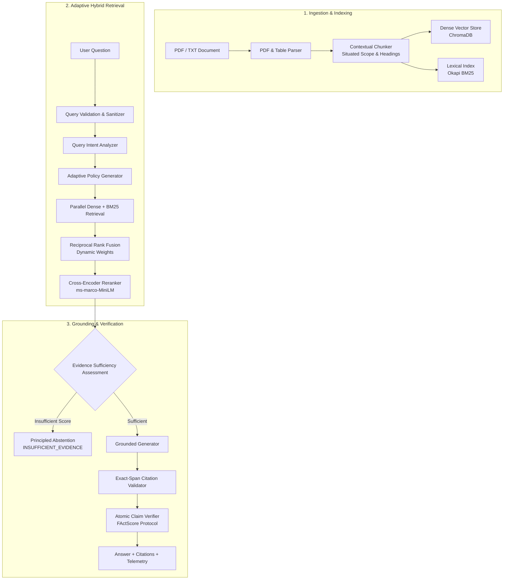

# Evidence-Aware RAG Pipeline

[](https://python.org)
[]()
[](LICENSE)

An open-source research and engineering framework for document-grounded question answering with strict evidence sufficiency checking, exact citation verification, and atomic claim factual auditing.

Designed for robust offline evaluation, multi-stage hybrid retrieval, and principled abstention when source evidence is incomplete or unverified.

---

## 1. What the Project Does

Standard RAG architectures frequently fail in document question answering due to context loss during chunking, retrieval mismatch on specific entities, unverified hallucinations, and absence of abstention criteria when evidence is missing.

This repository implements a modular, verifiable pipeline:
1. **Document Ingestion & Parsing**: Parses structured text and PDF documents with table matrix linearization.
2. **Contextual Chunking**: Situates chunk text with document-level synopsis and section hierarchy to prevent context fragmentation.
3. **Hybrid Retrieval**: Combines dense semantic similarity (Sentence-Transformers / text-embedding-3-small) with sparse lexical search (Okapi BM25).
4. **Adaptive Policy & RRF Fusion**: Classifies query intent to dynamically weight lexical vs. dense retrieval before Reciprocal Rank Fusion (RRF) and Cross-Encoder reranking.
5. **Evidence Sufficiency Assessment**: Computes multi-signal candidate relevance and cross-document agreement, returning explicit abstention (`INSUFFICIENT_EVIDENCE`) when evidence fails thresholds.
6. **Grounded Generation & Validation**: Enforces strict evidence grounding, verifies character-span citations against retrieved sources, and scores claim-level factual faithfulness.

---

## 2. Architecture



---

## 3. Core Design Decisions

- **Hybrid Fusion via Reciprocal Rank Fusion (RRF)**:
  Instead of fragile cross-modal score normalization, ranks are fused via weighted RRF:
  $$\text{RRF}(d) = w_{\text{dense}} \cdot \frac{1}{k + r_{\text{dense}}(d)} + w_{\text{lexical}} \cdot \frac{1}{k + r_{\text{lexical}}(d)}$$
  Weights are adjusted based on query classification (e.g., lexical-heavy for entity identifiers, dense-heavy for conceptual queries). Full mathematical derivations are documented in [docs/MATHEMATICAL_FORMULATIONS.md](docs/MATHEMATICAL_FORMULATIONS.md).
- **Separation of Core vs. Experimental**:
  The primary pipeline remains clean, demonstrable, and focused on core retrieval-augmented generation. Advanced prototypes (GraphRAG, ReAct Agentic Planning, HyDE, Rocchio PRF, ColBERT MaxSim, MMR) are decoupled into [`src/experimental/`](src/experimental/).
- **Principled Abstention over Speculation**:
  If retrieved context fails evidence sufficiency thresholds, the system explicitly abstains rather than producing speculative, ungrounded completions.
- **Zero-Key Deterministic Offline Mode**:
  The system includes deterministic embedding fallbacks (`DeterministicTermVectorEmbedder`) and grounded local extraction, allowing CI, unit testing, and benchmarking to run offline without paid API credentials.

---

## 4. Installation

### Requirements
- Python 3.11+
- Node.js 18+ (optional, only for the React visual dashboard)

### Setup

```bash
# Clone the repository
git clone https://github.com/arraimal70-code/RAG-Pipeline.git
cd RAG-Pipeline

# Install Python dependencies
pip install -r requirements.txt

# (Optional) Copy environment template if using OpenAI models
cp .env.example .env
```

---

## 5. Minimal Usage Example

### Python API

```python
from src.pipeline import RAGPipeline

# Initialize pipeline (uses local models and ChromaDB)
pipeline = RAGPipeline()

# Ingest document (PDF, TXT, or Markdown)
pipeline.ingest_document("data/documents/sample_report.txt")

# Run grounded query
response = pipeline.query("What was total operating revenue for fiscal year 2023?")

print("Answer:", response.answer)
print("Confidence:", response.confidence)
print("Support Level:", response.support_level)
print("Abstained:", response.abstained)

# Inspect citations
for cite in response.citations:
    print(f"[{cite.citation_id}] {cite.filename} (Page {cite.page_number}): {cite.relevant_text}")
```

### Interactive CLI

```bash
# Launch interactive console
python src/cli.py

# Run a single query directly
python src/cli.py --query "What were the primary revenue drivers in FY2023?"
```

---

## 6. Evaluation & Benchmark Methodology

The repository includes a quantitative evaluation harness ([`benchmarks/run_benchmark.py`](benchmarks/run_benchmark.py)) evaluating retrieval ranking, claim-level factual grounding, and principled abstention.

### Internal Benchmark Results

> **Note**: These numbers reflect an internal small-scale benchmark executed across 25 financial questions using synthetic multi-document reports with local Sentence-Transformers embeddings and BM25 Okapi retrieval. They represent reproducible internal validation measurements, not an external production claim.

| Metric Category | Metric | Internal Benchmark Value | Description |
|:---|:---|:---:|:---|
| **Retrieval Quality** | **NDCG@5** | **1.0000** | Ranking relevance of retrieved candidates (on matched corpus) |
| | **Hit@1** | **66.67%** | Relevant source at rank 1 |
| | **Hit@3 / Hit@5** | **66.67%** | Relevant source within top 3 / 5 |
| | **MRR@5** | **0.6667** | Mean Reciprocal Rank |
| **Faithfulness & Grounding** | **FActScore Claim Grounding** | **79.00%** | Percentage of atomic claims entailed by retrieved context |
| | **Hallucination Rate** | **21.00%** | Percentage of unsupported or ungrounded claims |
| **Principled Abstention** | **Abstention Precision** | **100.00%** | Accuracy on unanswerable / adversarial queries |
| | **Answer Coverage** | **95.45%** | Percentage of answerable questions addressed |
| **Execution Latency** | **P50 Latency** | **706.0 ms** | Median end-to-end turn time |
| | **P90 Latency** | **913.3 ms** | 90th percentile latency |
| | **Mean Latency** | **1115.6 ms** | Average query latency |

Run the benchmark:

```bash
# Run benchmark on verified 25-question test set
python benchmarks/run_benchmark.py --dataset benchmarks/verified_benchmark.json --samples 25
```

---

## 7. Testing

The test suite covers core indexing, contextual chunking, security sanitization, and experimental extensions without external network requirements:

```bash
# Run the complete test suite
pytest

# Run specific functional suites
pytest tests/test_adaptive_retrieval.py
pytest tests/test_security.py
pytest tests/test_stress.py
pytest tests/test_advanced_features.py
```

### Test Suite Structure

| Test File | Focus Area |
|:---|:---|
| `tests/test_config.py` | Configuration constraints and environment variable overrides |
| `tests/test_chunking.py` | Fixed-size, sentence, and recursive structure-aware chunking |
| `tests/test_contextual_retrieval.py` | Situated context prefixing and metadata preservation |
| `tests/test_retrieval.py` | Hybrid retrieval, RRF rank fusion, and score interleaving |
| `tests/test_adaptive_retrieval.py` | Query intent classification and dynamic retrieval policy weights |
| `tests/test_query_decomposition.py` | Multi-hop comparative question decomposition |
| `tests/test_security.py` | Prompt injection detection, path traversal, and payload sanitization |
| `tests/test_security_comprehensive.py` | Unicode sanitization, boundary checks, and API rate limiting |
| `tests/test_stress.py` | Multi-threaded query concurrency, numerical edge cases, and needle-in-haystack retrieval |
| `tests/test_extended_retrieval.py` | ColBERT MaxSim, Rocchio PRF, query rewriting, and table parsing |
| `tests/test_advanced_features.py` | GraphRAG, Agentic ReAct planner, hierarchical chunking, and MMR |
| `tests/test_integration.py` | End-to-end ingestion and query pipeline execution |

---

## 8. Optional & Experimental Research Features

Advanced retrieval and reasoning prototypes are isolated in [`src/experimental/`](src/experimental/):

- **GraphRAG (`src/experimental/graph_rag.py`)**: In-memory entity-relationship knowledge graph with co-occurrence edge extraction and community detection (inspired by Edge et al., Microsoft Research).
- **Agentic ReAct Planner (`src/experimental/agentic_planner.py`)**: Autonomous multi-step ReAct planner for iterative retrieval and multi-document synthesis.
- **HyDE (`src/experimental/hyde.py`)**: Hypothetical Document Embeddings for zero-shot dense query synthesis (Gao et al., ACL 2023).
- **Rocchio / RM3 PRF (`src/experimental/prf.py`)**: Pseudo-Relevance Feedback dense query expansion with cosine-drift guardrails.
- **Late-Interaction MaxSim (`src/experimental/late_interaction.py`)**: Token-level alignment scoring inspired by ColBERT (Khattab & Zaharia, SIGIR 2020).
- **Hierarchical Indexing (`src/experimental/hierarchical.py`)**: Parent-child small-to-big context expansion.
- **MMR Reranking (`src/experimental/mmr.py`)**: Maximal Marginal Relevance diversity reranking (Carbonell & Goldstein, SIGIR 1998).
- **Corrective RAG & Self-RAG (`src/experimental/crag.py`)**: Retrieval confidence evaluation and reflection critique tokens ([ISREL], [ISSUP], [ISUSE]).

---

## 9. Research Attribution & References

This project is an independent research and software engineering implementation inspired by the following papers:

1. **Contextual Retrieval**: Anthropic (2024). *Contextual Retrieval: Improving Retrieval for AI Applications*.
2. **FActScore**: Min, S., Krishna, K., Lyu, X., Lewis, M., Yih, W., Koh, P. W., Iyyer, M., Zettlemoyer, L., & Hajishirzi, H. (2023). *FActScore: Fine-grained Atomic Evaluation of Factual Precision in Long Form Text Generation*. EMNLP 2023.
3. **Multi-Hop Decomposition & DSPy**: Khattab, O., et al. (2023). *DSPy: Compiling Declarative Language Model Calls into Self-Improving Pipelines*. Stanford University.
4. **Reciprocal Rank Fusion (RRF)**: Cormack, G. V., Clarke, C. L., & Buettcher, S. (2009). *Reciprocal rank fusion outperforms Condorcet and individual rank learning methods*. SIGIR 2009.
5. **Hypothetical Document Embeddings (HyDE)**: Gao, L., Dai, X., Pan, F., & Callan, J. (2023). *Precise Zero-Shot Dense Retrieval without Relevance Labels*. ACL 2023.
6. **Corrective RAG (CRAG)**: Yan, S., et al. (2024). *Corrective Retrieval Augmented Generation*. arXiv:2401.15884.
7. **Self-RAG**: Asai, A., et al. (2024). *Self-RAG: Learning to Retrieve, Generate, and Critique through Self-Reflection*. ICLR 2024.
8. **Graph RAG**: Edge, D., et al. (2024). *From Local to Global: A Graph RAG Approach to Query-Focused Summarization*. Microsoft Research.
9. **ColBERT**: Khattab, O., & Zaharia, M. (2020). *ColBERT: Efficient and Effective Passage Search via Contextualized Late Interaction over BERT*. SIGIR 2020.
10. **Maximal Marginal Relevance (MMR)**: Carbonell, J., & Goldstein, J. (1998). *The use of MMR, diversity-based reranking for reordering documents and producing summaries*. SIGIR 1998.

---

## 10. Repository Structure

```
.
├── benchmarks/              # Evaluation datasets and quantitative benchmark runner
│   ├── run_benchmark.py     # Evaluation harness (NDCG, Hit@K, FActScore, Latency)
│   └── verified_benchmark.json
├── docs/                    # Architecture documentation & mathematical formulations
│   ├── ARCHITECTURE.md
│   └── MATHEMATICAL_FORMULATIONS.md
├── scripts/                 # Utility scripts for profiling and corpus generation
│   ├── measure_performance.py
│   └── measure_scalability.py
├── src/                     # Core RAG pipeline package
│   ├── adaptive/            # Query classification and dynamic retrieval policy
│   ├── cache/               # Semantic query cache with cosine similarity
│   ├── chunking/            # Contextual chunker & situated text grounding
│   ├── citations/           # Exact character-span citation validator
│   ├── claims/              # Atomic claim extraction & faithfulness scoring
│   ├── core/                # Configuration and Pydantic models
│   ├── embeddings/          # SentenceTransformers, OpenAI, and deterministic fallbacks
│   ├── evaluation/          # Retrieval & generation evaluators
│   ├── evidence/            # Evidence sufficiency assessment
│   ├── experimental/        # Isolated research features (GraphRAG, ReAct, HyDE, etc.)
│   ├── generation/          # Grounded LLM generator with principled abstention
│   ├── indexing/            # ChromaDB vector store and Okapi BM25 index
│   ├── parsing/             # PDF parser and tabular matrix linearizer
│   ├── reasoning/           # Numerical calculations and temporal filtering
│   ├── retrieval/           # Hybrid retriever and Reciprocal Rank Fusion (RRF)
│   ├── security/            # Prompt injection defense, rate limiting, and sanitizers
│   ├── cli.py               # Interactive terminal REPL and query console
│   └── pipeline.py          # Unified RAGPipeline entry point
├── tests/                   # Pytest test suite (137 passed, 1 skipped)
├── Dockerfile               # Multi-stage production container definition
├── pytest.ini               # Pytest configuration
├── package.json             # Frontend visual dashboard dependencies
└── requirements.txt         # Core Python dependencies
```
