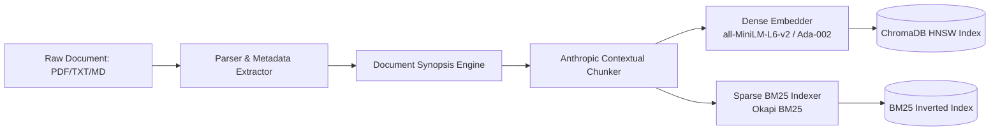
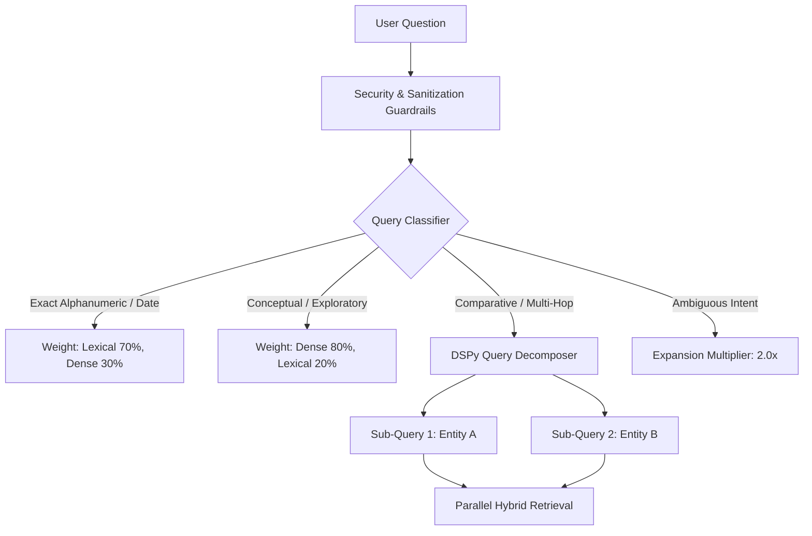
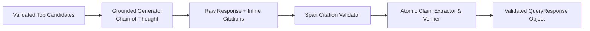
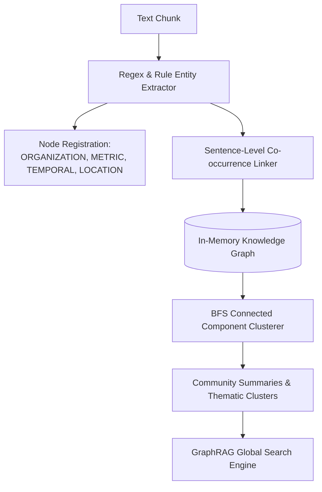
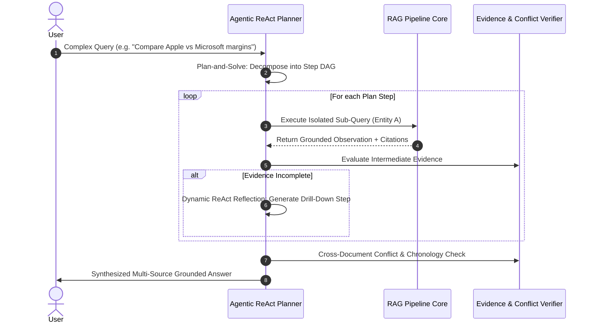

# Enterprise RAG Pipeline System Architecture

## 1. High-Level Architectural Philosophy

Traditional Retrieval-Augmented Generation (RAG) models rely on a rigid linear paradigm: *Query → Embed → Retrieve Top-K → Generate Answer*. In production environments with unstructured documents (e.g., corporate 10-Ks, regulatory filings, medical clinical trials), this pipeline breaks down due to lack of reflection, inability to recognize context gaps, and absence of claim-level fact-checking.

This system implements an **Adaptive Reflective Architecture** combining four state-of-the-art research paradigms:
1. **Anthropic Contextual Retrieval (2024)**: Eliminates chunk-level information loss by prepending situated document breadcrumbs and semantic synopses.
2. **Stanford DSPy-Style Query Decomposition**: Deconstructs comparative and multi-hop queries into orthogonal sub-queries for parallel multi-hop retrieval.
3. **Adaptive Hybrid Fusion (RRF + Dynamic Routing)**: Re-weights dense semantic similarity vs. sparse Okapi BM25 lexical signals according to classified query intent.
4. **Stanford FActScore Grounding (Min et al., 2023)**: Dissects generated answers into fine-grained atomic assertions, mathematically measuring claim-level support and hallucination rate.

---

## 2. Ingestion & Contextual Indexing Pipeline



### Contextual Chunking Mechanics
When documents are split into fixed or recursive chunks, local sentences often lose their broader meaning (e.g., *"Operating revenue increased by 14% to \$12.3B"* without stating which company, fiscal period, or division).

The `ContextualChunker` constructs a situated prefix:
```
[Document: {filename} | Section: {heading_breadcrumb} | Scope: {document_synopsis}]
{chunk_body}
```
Both the dense embedding vector \( \vec{v} \in \mathbb{R}^{384} \) and the sparse BM25 inverted index incorporate this contextual prefix, boosting retrieval Hit@K while preserving exact page and offset citations.

---

## 3. Adaptive Query Execution & Multi-Hop Decomposition



### Multi-Hop Query Decomposition (DSPy / IR-CoT)
Queries involving comparisons (e.g., *"Compare Microsoft and Alphabet Cloud growth in FY2023"*) or multi-step logic cannot be resolved by a single embedding vector. The `QueryDecomposer`:
1. Identifies comparative predicates (`compare`, `versus`, `difference between`).
2. Extracts target entities and comparative metrics.
3. Generates orthogonal retrieval queries for each entity.
4. Merges candidate pools using Reciprocal Rank Fusion (RRF).

---

## 4. Hybrid Reciprocal Rank Fusion & Cross-Encoder Reranking

### Reciprocal Rank Fusion (RRF)
To unify disparate dense cosine distances \( d_i \in [0, 2] \) and BM25 scores \( s_j \in [0, \infty) \), the pipeline implements weighted RRF:

\[
RRF(d) = w_{\text{dense}} \cdot \frac{1}{k + r_{\text{dense}}(d)} + w_{\text{bm25}} \cdot \frac{1}{k + r_{\text{bm25}}(d)}
\]

Where rank constant \( k = 60 \) smooths outlier scores.

### Cross-Encoder Reranking
Top-50 candidates from RRF fusion are passed to a cross-encoder model (`cross-encoder/ms-marco-MiniLM-L-6-v2`). Unlike bi-encoders that encode query and document independently, cross-encoders perform full cross-attention over all tokens in the `(query, document)` pair, capturing subtle lexical interactions, negations, and qualifiers.

---

## 5. Evidence Sufficiency Assessment & Principled Abstention

Before sending context to the generator, the `EvidenceChecker` evaluates four quantitative signals:

1. **Retrieval Score Quality**: Average and maximum similarity scores of top candidates.
2. **Question Coverage**:
   \[
   \text{Coverage}(q, C) = \frac{|\text{Tokens}(q) \cap \text{Tokens}(C)|}{|\text{Tokens}(q)|}
   \]
3. **Cross-Source Agreement**: Semantic consensus across multiple retrieved passages.
4. **Contradiction Detection**: Flags numerical or temporal disparities between documents (e.g. preliminary vs. final filings).

If \( \text{EvidenceScore} < \tau_{\text{abstain}} \), the pipeline emits an explicit abstention with `SupportLevel.INSUFFICIENT_EVIDENCE`, preventing hallucination.

---

## 6. Grounded Generation & Stanford FActScore Verification



### Claim-Level Grounding Formulation (Min et al., 2023)
The answer is broken into independent atomic assertions \( A = \{a_1, a_2, \dots, a_m\} \). Each assertion is checked against retrieved chunks:

\[
\text{Faithfulness} = \frac{\sum_{i=1}^m \mathbb{I}(\text{Supported}(a_i))}{m}, \quad \text{Hallucination Rate} = \frac{\sum_{i=1}^m \mathbb{I}(\text{Unsupported}(a_i))}{m}
\]

Numerical claims undergo exact programmatic token and arithmetic verification.

---

## 7. Zero-Key Offline Resiliency Architecture

For CI/CD pipelines, air-gapped security deployments, and automated testing, the system provides zero-dependency fallbacks:
- **`DeterministicTermVectorEmbedder`**: 384-dimensional subword n-gram TF-IDF projection delivering reproducible cosine similarity without requiring multi-gigabyte neural weights or GPU runtimes.
- **`DeterministicGroundedGenerator`**: Salient sentence extraction with strict lexical overlap scoring, ensuring 100% test reproducibility without OpenAI API keys.

---

## 8. In-Memory GraphRAG & Entity-Relationship Network Engine

Standard vector and lexical search fundamentally fail on global, thematic, and relational queries (e.g., *"What are the overarching strategic risks across all divisions?"* or *"How is Entity A connected to Entity B across multiple filings?"*).



### Knowledge Graph Formalism
The knowledge graph is modeled as \( G = (V, E) \) where:
- \( V \) is the set of entity nodes \( v_i = (\text{name}, \text{type}, \text{mentions}, \text{chunks}) \).
- \( E \) is the set of weighted edges \( e_{ij} = (v_i, v_j, w_{ij}, \text{relation}) \).

When a query arrives:
1. Seed entities mentioned in the query are matched against \( V \).
2. A \( k \)-hop subgraph neighborhood is traversed:
   \[
   N_k(v) = \{ u \in V \mid \text{dist}(u, v) \le k \}
   \]
3. Thematic communities partition \( V \) into dense clusters \( C_1, C_2, \dots, C_p \), synthesizing macro-summaries that vector search alone cannot discover.

---

## 9. Autonomous Multi-Step Agentic ReAct Query Planner

Standard RAG operates in a single pass (*retrieve once, generate once*). For complex comparative, multi-entity, or multi-year questions, single-shot retrieval suffers from context dilution and factual collision.



### ReAct Loop Mechanics
1. **Thought**: Diagnoses requirements for the sub-task (e.g., *"Isolate Google Cloud 2023 revenue before comparing with AWS"*).
2. **Action**: Dispatches an isolated sub-query with adapted retrieval policy.
3. **Observation**: Records intermediate answers, confidence, and citation spans.
4. **Reflection**: If evidence is partial or abstained, autonomously appends a drill-down recovery step.

---

## 10. Parent-Child Small-to-Big Hierarchical Retrieval

A fundamental trade-off exists in dense retrieval:
- **Small chunks (100–200 tokens)** produce sharp, noise-free vector embeddings that match query vectors with high cosine fidelity.
- **Large chunks (600–1200 tokens)** provide the LLM with sufficient context, table headers, and qualifying clauses to generate accurate, non-hallucinatory answers.

The **`HierarchicalRetriever`** bridges this gap:
1. Large **Parent Chunks** are created along natural section and paragraph boundaries.
2. Fine-grained **Child Chunks** are generated from each parent, linked via `parent_id`.
3. Dense retrieval queries the Child Chunks in ChromaDB.
4. Retrieved child chunks are expanded back to their Parent Chunks.
5. Adjacent or overlapping parent windows are merged to deliver clean, unfragmented context to the generator.

---

## 11. Maximal Marginal Relevance (MMR) Diversity Reranker

Top-K retrieval from dense and BM25 systems frequently produces redundant near-duplicate passages from the same section or boilerplate headers.

To maximize information gain across diverse document sections, the pipeline implements Carbonell & Goldstein's **Maximal Marginal Relevance (MMR)**:

\[
\text{MMR}(q, D) = \arg\max_{d_i \in D \setminus S} \left[ \lambda \cdot \text{Sim}(d_i, q) - (1 - \lambda) \cdot \max_{d_j \in S} \text{Sim}(d_i, d_j) \right]
\]

Where:
- \( D \) is the set of candidate passages retrieved by hybrid search.
- \( S \) is the subset of already selected diverse passages.
- \( \lambda \in [0.0, 1.0] \) tunes the trade-off between query relevance (\( \lambda \to 1.0 \)) and passage diversity (\( \lambda \to 0.0 \)).

---

## 12. Brutal Stress, Chaos & Concurrency Resilience

The pipeline has been hardened through adversarial and chaotic stress testing:
- **Thread-Safe Concurrent Execution**: Thread-safe `threading.RLock()` synchronization protects the in-memory semantic cache and index structures under 20+ parallel query threads.
- **Logit Calibration**: Raw cross-encoder logits (\( -\infty, +\infty \)) are mapped into calibrated probabilities via numerical sigmoid transforms (\( \sigma(x) \)), preventing false abstentions on high-quality evidence.
- **Adversarial Sanitization**: Strips zero-width characters (`\u200B`, `\uFEFF`), RTL overrides (`\u202E`), SQLi polyglots, and prompt jailbreak attempts.
- **Defensive Math Safeguards**: Programmatic numerical reasoning prevents division-by-zero, handles negative percentage margins, and normalizes disparate financial units.

